# FIFA Nexus AI — Database ER Diagram & Schema Design

## Entity Relationship Diagram

```mermaid
erDiagram
    USERS ||--o{ TICKETS : purchases
    USERS ||--o{ ACCESSIBILITY_REQUESTS : submits
    USERS ||--o{ INCIDENTS : reports
    USERS ||--o{ FAN_PREFERENCES : has
    USERS {
        uuid id PK
        string firebase_uid UK
        string email UK
        string display_name
        enum role "fan|volunteer|security|manager|transport|medical|vendor|admin"
        string language_preference
        string phone
        string avatar_url
        timestamp created_at
        timestamp updated_at
        boolean is_active
    }

    TICKETS ||--|| SEATS : assigns
    TICKETS {
        uuid id PK
        uuid user_id FK
        uuid seat_id FK
        uuid match_id FK
        string ticket_code UK
        enum status "active|used|expired|cancelled"
        string gate_entry
        timestamp entry_time
        timestamp created_at
    }

    MATCHES ||--o{ TICKETS : has
    MATCHES {
        uuid id PK
        uuid stadium_id FK
        string team_home
        string team_away
        timestamp kickoff_time
        enum status "scheduled|live|halftime|completed|cancelled"
        integer expected_attendance
        integer actual_attendance
        timestamp created_at
    }

    STADIUMS ||--o{ MATCHES : hosts
    STADIUMS ||--o{ STADIUM_ZONES : contains
    STADIUMS {
        uuid id PK
        string name
        string city
        string country
        integer total_capacity
        float latitude
        float longitude
        jsonb map_data
        jsonb facilities
        timestamp created_at
    }

    STADIUM_ZONES ||--o{ SEATS : contains
    STADIUM_ZONES ||--o{ CROWD_METRICS : measures
    STADIUM_ZONES ||--o{ CAMERAS : monitors
    STADIUM_ZONES {
        uuid id PK
        uuid stadium_id FK
        string zone_code UK
        string zone_name
        enum zone_type "stand|concourse|gate|parking|food_court|medical|vip|service"
        integer capacity
        float area_sqm
        jsonb polygon_coords
        jsonb accessibility_features
        boolean is_active
    }

    SEATS {
        uuid id PK
        uuid zone_id FK
        string section
        string row_number
        string seat_number
        enum seat_type "standard|premium|vip|accessible|companion"
        boolean is_accessible
        jsonb coordinates
    }

    CROWD_METRICS {
        uuid id PK
        uuid zone_id FK
        uuid match_id FK
        integer current_count
        integer capacity
        float density_percentage
        enum risk_level "low|medium|high|critical"
        float flow_rate_in
        float flow_rate_out
        jsonb sensor_data
        timestamp measured_at
    }

    CROWD_PREDICTIONS {
        uuid id PK
        uuid zone_id FK
        uuid match_id FK
        integer predicted_count_5min
        integer predicted_count_10min
        integer predicted_count_15min
        float confidence_5min
        float confidence_10min
        float confidence_15min
        enum predicted_risk "low|medium|high|critical"
        jsonb suggested_actions
        string reasoning
        timestamp predicted_at
        timestamp created_by_agent
    }

    TRANSPORT_METRICS {
        uuid id PK
        uuid match_id FK
        enum transport_type "metro|bus|rideshare|parking|walking"
        string route_name
        float congestion_level
        integer estimated_wait_minutes
        integer available_capacity
        jsonb route_data
        enum status "normal|delayed|congested|closed"
        timestamp measured_at
    }

    TRANSPORT_PREDICTIONS {
        uuid id PK
        uuid match_id FK
        enum transport_type "metro|bus|rideshare|parking|walking"
        float predicted_congestion_5min
        float predicted_congestion_15min
        float predicted_congestion_30min
        string best_exit_gate
        string best_parking_zone
        jsonb fastest_route
        jsonb least_crowded_route
        string reasoning
        timestamp predicted_at
    }

    INCIDENTS ||--o{ INCIDENT_UPDATES : tracks
    INCIDENTS {
        uuid id PK
        uuid reported_by FK
        uuid assigned_to FK
        uuid zone_id FK
        uuid match_id FK
        enum incident_type "medical|security|fire|structural|crowd|weather|other"
        enum severity "low|medium|high|critical"
        string description
        string ai_summary
        jsonb ai_extracted_data
        jsonb location_coords
        enum status "reported|triaged|dispatched|in_progress|resolved|closed"
        string dispatch_recommendation
        string nearest_responder_id
        string fastest_route
        float crowd_level_at_location
        timestamp reported_at
        timestamp resolved_at
    }

    INCIDENT_UPDATES {
        uuid id PK
        uuid incident_id FK
        uuid updated_by FK
        string update_text
        enum status_change "triaged|dispatched|in_progress|resolved|closed"
        timestamp created_at
    }

    VOLUNTEERS ||--o{ VOLUNTEER_TASKS : assigned
    VOLUNTEERS {
        uuid id PK
        uuid user_id FK
        uuid match_id FK
        uuid current_zone_id FK
        jsonb skills
        enum shift_status "on_duty|break|off_duty"
        timestamp shift_start
        timestamp shift_end
        float latitude
        float longitude
        boolean is_available
        timestamp last_location_update
    }

    VOLUNTEER_TASKS {
        uuid id PK
        uuid volunteer_id FK
        uuid zone_id FK
        uuid match_id FK
        string task_description
        enum priority "low|medium|high|urgent"
        enum status "pending|assigned|in_progress|completed|cancelled"
        integer estimated_minutes
        string shortest_path
        boolean is_emergency
        string ai_assignment_reason
        timestamp assigned_at
        timestamp completed_at
    }

    FOOD_VENDORS ||--o{ VENDOR_METRICS : reports
    FOOD_VENDORS {
        uuid id PK
        uuid zone_id FK
        string vendor_name
        jsonb menu_items
        enum cuisine_type "fast_food|beverages|snacks|international|halal|vegan|other"
        boolean is_halal
        boolean is_vegetarian
        boolean is_accessible
        jsonb location_coords
        enum status "open|busy|closing|closed"
        timestamp created_at
    }

    VENDOR_METRICS {
        uuid id PK
        uuid vendor_id FK
        uuid match_id FK
        integer queue_length
        integer estimated_wait_minutes
        jsonb stock_levels
        float revenue
        timestamp measured_at
    }

    ACCESSIBILITY_REQUESTS {
        uuid id PK
        uuid user_id FK
        uuid match_id FK
        enum request_type "wheelchair|blind|low_vision|hearing|mobility|other"
        string description
        enum status "pending|assigned|in_progress|completed"
        uuid assigned_volunteer_id FK
        jsonb accessible_route
        timestamp created_at
        timestamp resolved_at
    }

    ENERGY_METRICS {
        uuid id PK
        uuid stadium_id FK
        uuid match_id FK
        string zone_or_system
        float electricity_kwh
        float solar_generation_kwh
        float hvac_load_kwh
        float lighting_load_kwh
        timestamp measured_at
    }

    WATER_METRICS {
        uuid id PK
        uuid stadium_id FK
        uuid match_id FK
        string zone_or_system
        float consumption_liters
        float recycled_liters
        float irrigation_liters
        timestamp measured_at
    }

    WASTE_METRICS {
        uuid id PK
        uuid stadium_id FK
        uuid match_id FK
        float plastic_kg
        float food_waste_kg
        float general_waste_kg
        float recycled_kg
        float carbon_footprint_kg_co2
        timestamp measured_at
    }

    CAMERAS {
        uuid id PK
        uuid zone_id FK
        string camera_code
        string camera_name
        jsonb location_coords
        enum status "active|inactive|maintenance"
        string stream_url
    }

    CAMERA_EVENTS {
        uuid id PK
        uuid camera_id FK
        uuid match_id FK
        enum event_type "crowd_gathering|unusual_movement|restricted_area|unattended_object|altercation|other"
        string ai_summary
        float confidence
        enum severity "info|warning|alert|critical"
        jsonb frame_data
        string recommendation
        timestamp detected_at
        boolean is_acknowledged
    }

    AI_REPORTS {
        uuid id PK
        uuid match_id FK
        enum report_type "daily_briefing|executive_summary|incident_report|sustainability_report|crowd_report|transport_report"
        string title
        text content
        jsonb structured_data
        string generated_by_agent
        jsonb agent_context
        timestamp generated_at
    }

    ALERTS {
        uuid id PK
        uuid match_id FK
        uuid zone_id FK
        enum alert_type "crowd|security|medical|weather|transport|sustainability|system"
        enum severity "info|warning|critical|emergency"
        string title
        string message
        string ai_recommendation
        enum status "active|acknowledged|resolved|expired"
        jsonb target_roles
        timestamp created_at
        timestamp acknowledged_at
        timestamp resolved_at
    }

    PREDICTIONS {
        uuid id PK
        uuid match_id FK
        string agent_name
        enum prediction_type "crowd|transport|security|weather|vendor|energy"
        jsonb prediction_data
        float confidence
        string reasoning
        timestamp prediction_for
        timestamp created_at
        float actual_accuracy
    }

    FAN_PREFERENCES {
        uuid id PK
        uuid user_id FK
        jsonb favorite_foods
        jsonb dietary_restrictions
        enum accessibility_needs "none|wheelchair|blind|low_vision|hearing|mobility"
        string preferred_transport
        jsonb preferred_zones
        boolean notifications_enabled
        timestamp updated_at
    }

    WEATHER_DATA {
        uuid id PK
        uuid stadium_id FK
        float temperature_c
        float humidity_percent
        float wind_speed_kmh
        string wind_direction
        float precipitation_mm
        string conditions
        float uv_index
        string forecast_summary
        timestamp measured_at
        timestamp forecast_for
    }

    AGENT_LOGS {
        uuid id PK
        uuid match_id FK
        string agent_name
        string action
        jsonb input_context
        jsonb output_data
        integer tokens_used
        float latency_ms
        enum status "success|error|timeout"
        timestamp created_at
    }

    USERS ||--o{ FAN_PREFERENCES : configures
    USERS ||--o{ VOLUNTEERS : serves_as
    MATCHES ||--o{ CROWD_METRICS : generates
    MATCHES ||--o{ CROWD_PREDICTIONS : generates
    MATCHES ||--o{ TRANSPORT_METRICS : generates
    MATCHES ||--o{ TRANSPORT_PREDICTIONS : generates
    MATCHES ||--o{ INCIDENTS : occurs_during
    MATCHES ||--o{ VOLUNTEER_TASKS : scheduled_for
    MATCHES ||--o{ VENDOR_METRICS : tracked_during
    MATCHES ||--o{ ENERGY_METRICS : measured_during
    MATCHES ||--o{ WATER_METRICS : measured_during
    MATCHES ||--o{ WASTE_METRICS : measured_during
    MATCHES ||--o{ CAMERA_EVENTS : detected_during
    MATCHES ||--o{ AI_REPORTS : generated_for
    MATCHES ||--o{ ALERTS : raised_during
    MATCHES ||--o{ PREDICTIONS : made_for
    CAMERAS ||--o{ CAMERA_EVENTS : triggers
    STADIUMS ||--o{ ENERGY_METRICS : monitors
    STADIUMS ||--o{ WATER_METRICS : monitors
    STADIUMS ||--o{ WASTE_METRICS : monitors
    STADIUMS ||--o{ WEATHER_DATA : records
```



---

## Schema Statistics

| Entity | Estimated Row Count (per match) | Growth Rate |
|--------|-------------------------------|-------------|
| Users | 100,000+ | Per tournament |
| Tickets | 80,000 | Per match |
| Crowd Metrics | ~50,000 | Every 30 seconds × 50 zones |
| Crowd Predictions | ~5,000 | Every 60 seconds × 50 zones |
| Transport Metrics | ~10,000 | Every 60 seconds |
| Incidents | ~50-200 | Per match |
| Volunteer Tasks | ~500-2,000 | Per match |
| Camera Events | ~1,000-5,000 | Per match |
| AI Reports | ~100-500 | Per match |
| Alerts | ~200-1,000 | Per match |
| Agent Logs | ~50,000+ | Per match |

## Indexing Strategy

```sql
-- Critical performance indexes
CREATE INDEX idx_crowd_metrics_zone_time ON crowd_metrics(zone_id, measured_at DESC);
CREATE INDEX idx_crowd_metrics_match ON crowd_metrics(match_id, measured_at DESC);
CREATE INDEX idx_incidents_status ON incidents(status, severity, match_id);
CREATE INDEX idx_incidents_zone ON incidents(zone_id, reported_at DESC);
CREATE INDEX idx_volunteer_tasks_status ON volunteer_tasks(status, priority, match_id);
CREATE INDEX idx_volunteer_tasks_volunteer ON volunteer_tasks(volunteer_id, status);
CREATE INDEX idx_alerts_active ON alerts(status, severity, match_id) WHERE status = 'active';
CREATE INDEX idx_camera_events_time ON camera_events(camera_id, detected_at DESC);
CREATE INDEX idx_transport_metrics_type ON transport_metrics(transport_type, measured_at DESC);
CREATE INDEX idx_predictions_agent ON predictions(agent_name, match_id, created_at DESC);
CREATE INDEX idx_agent_logs_agent ON agent_logs(agent_name, match_id, created_at DESC);
CREATE INDEX idx_users_firebase ON users(firebase_uid);
CREATE INDEX idx_tickets_user ON tickets(user_id, match_id);
CREATE INDEX idx_weather_stadium ON weather_data(stadium_id, measured_at DESC);

-- Partitioning strategy for high-volume tables
-- crowd_metrics: partition by match_id
-- agent_logs: partition by created_at (monthly)
-- camera_events: partition by match_id
```

## Data Retention Policy

| Data Category | Hot (SSD) | Warm (Standard) | Archive |
|--------------|-----------|-----------------|---------|
| Crowd Metrics | Current match | Last 7 days | Cloud Storage |
| Agent Logs | Current match | Last 3 days | Cloud Storage |
| Camera Events | Current match | Last 7 days | Cloud Storage |
| Incidents | Last 30 days | Last 90 days | Permanent |
| AI Reports | Last 30 days | Last 90 days | Permanent |
| Transport Metrics | Current match | Last 7 days | Cloud Storage |
