# FIFA Nexus AI — Backend Architecture & API Documentation

---

## Backend Architecture Overview

```mermaid
graph TB
    subgraph "API Layer"
        R[FastAPI Router v1]
        WS[Socket.IO Gateway]
    end

    subgraph "Middleware"
        AUTH[Firebase Auth Middleware]
        CORS[CORS Middleware]
        LOG[Request Logging]
        RATE[Rate Limiter]
    end

    subgraph "Service Layer"
        CS[Crowd Service]
        TS[Transport Service]
        IS[Incident Service]
        VS[Volunteer Service]
        VDS[Vendor Service]
        AS[Accessibility Service]
        SS[Sustainability Service]
        SEC[Security Service]
        WS2[Weather Service]
        FS[Fan Service]
        RS[Report Service]
        ALS[Alert Service]
        RTS[Realtime Service]
    end

    subgraph "Repository Layer"
        CR[Crowd Repository]
        TR[Transport Repository]
        IR[Incident Repository]
        VR[Volunteer Repository]
        VDR[Vendor Repository]
        AR[Accessibility Repository]
        SR[Sustainability Repository]
        SCR[Camera Repository]
        WR[Weather Repository]
        ALR[Alert Repository]
        PR[Prediction Repository]
        RPR[Report Repository]
    end

    subgraph "AI Layer"
        COORD[Coordinator Agent]
        subgraph "Specialist Agents"
            CA[Crowd Agent]
            TA[Transport Agent]
            SA[Security Agent]
            VA[Volunteer Agent]
            VDA[Vendor Agent]
            AA[Accessibility Agent]
            WA[Weather Agent]
            EA[Energy Agent]
            EMA[Emergency Agent]
        end
        LG[LangGraph Workflow]
        GEM[Gemini 2.5 Pro / Flash]
    end

    subgraph "Data Layer"
        PG[(PostgreSQL)]
        RD[(Redis Cache)]
    end

    subgraph "External"
        WAPI[Weather API]
        MAPI[Maps API]
        TAPI[Traffic API]
        TRAPI[Transit API]
    end

    R --> AUTH --> CS & TS & IS & VS & VDS & AS & SS & SEC & WS2 & FS & RS & ALS
    WS --> RTS

    CS --> CR --> PG
    CS --> CA
    TS --> TR --> PG
    TS --> TA
    IS --> IR --> PG
    IS --> EMA
    VS --> VR --> PG
    VS --> VA
    VDS --> VDR --> PG
    VDS --> VDA
    AS --> AR --> PG
    AS --> AA
    SS --> SR --> PG
    SS --> EA
    SEC --> SCR --> PG
    SEC --> SA
    WS2 --> WR --> PG
    WS2 --> WA
    RS --> RPR --> PG
    ALS --> ALR --> PG
    FS --> COORD

    CA & TA & SA & VA & VDA & AA & WA & EA & EMA --> COORD
    COORD --> LG --> GEM

    WA --> WAPI
    TA --> MAPI & TAPI & TRAPI
    CA --> RD
    RTS --> RD

    style GEM fill:#4285f4,color:#fff
    style COORD fill:#ea4335,color:#fff
    style PG fill:#336791,color:#fff
    style RD fill:#dc382d,color:#fff
```



---

## Clean Architecture Layers

### Layer 1: API Routes (`app/api/v1/`)
- HTTP endpoint definitions
- Request validation via Pydantic schemas
- Response serialization
- No business logic

### Layer 2: Services (`app/services/`)
- Business logic and orchestration
- Calls repositories for data access
- Calls AI agents for intelligence
- Emits WebSocket events via Realtime Service

### Layer 3: Repositories (`app/repositories/`)
- Database CRUD operations only
- SQLAlchemy queries
- Caching via Redis
- No business logic

### Layer 4: AI Agents (`app/agents/`)
- LangGraph agent definitions
- Gemini API calls
- Prompt templates
- Structured output parsing

---

## Dependency Injection

```python
# app/dependencies.py

from functools import lru_cache
from app.core.database import get_db_session
from app.core.redis import get_redis_client
from app.repositories.crowd_repository import CrowdRepository
from app.services.crowd_service import CrowdService
from app.agents.crowd_agent import CrowdAgent

def get_crowd_repository(db=Depends(get_db_session)) -> CrowdRepository:
    return CrowdRepository(db)

def get_crowd_agent() -> CrowdAgent:
    return CrowdAgent()

def get_crowd_service(
    repo=Depends(get_crowd_repository),
    agent=Depends(get_crowd_agent),
    redis=Depends(get_redis_client)
) -> CrowdService:
    return CrowdService(repo, agent, redis)
```

---

## API Documentation

### Base URL
```
Production:  https://api.fifanexus.ai/v1
Development: http://localhost:8000/v1
WebSocket:   ws://localhost:8000/ws
```

### Authentication
All endpoints require Firebase ID Token in Authorization header:
```
Authorization: Bearer <firebase_id_token>
```

### Role-Based Access

| Role | Accessible Modules |
|------|--------------------|
| `admin` | All |
| `manager` | Command Center, Analytics, Reports, Executive Insights |
| `security` | Security Copilot, Incidents, Cameras, Crowd |
| `volunteer` | Volunteer Copilot, Tasks, Navigation |
| `transport` | Transport AI, Parking, Traffic |
| `medical` | Incidents, Emergency, Accessibility |
| `vendor` | Vendor Dashboard |
| `fan` | Fan Assistant, Navigation, Transport |

---

### API Endpoints

#### Authentication
```
POST   /v1/auth/register          Register new user
POST   /v1/auth/login             Login (Firebase token verification)
GET    /v1/auth/me                Get current user profile
PUT    /v1/auth/me                Update profile
POST   /v1/auth/refresh           Refresh session
```

#### Dashboard (Command Center)
```
GET    /v1/dashboard/overview     Complete dashboard data
GET    /v1/dashboard/summary      AI-generated situation summary
GET    /v1/dashboard/alerts       Active alerts feed
GET    /v1/dashboard/kpis         Key performance indicators
POST   /v1/dashboard/command      Natural language command input
```

**GET /v1/dashboard/overview** Response:
```json
{
  "match": {
    "id": "uuid",
    "teams": "Brazil vs Germany",
    "status": "live",
    "minute": 42,
    "attendance": 78542
  },
  "crowd": {
    "total_occupancy": 87.3,
    "zones": [
      {
        "zone_id": "uuid",
        "zone_code": "NS-A",
        "zone_name": "North Stand A",
        "density_percent": 92.1,
        "risk_level": "high",
        "trend": "increasing"
      }
    ],
    "predictions": {
      "5min": { "avg_density": 89.5, "confidence": 0.87 },
      "10min": { "avg_density": 91.2, "confidence": 0.78 },
      "15min": { "avg_density": 88.1, "confidence": 0.65 }
    }
  },
  "weather": {
    "temperature_c": 28.5,
    "humidity": 65,
    "conditions": "Partly Cloudy",
    "uv_index": 6.2
  },
  "transport": {
    "metro_status": "normal",
    "parking_occupancy": 73.2,
    "traffic_level": "moderate",
    "delays": []
  },
  "security": {
    "active_alerts": 2,
    "cameras_online": 48,
    "cameras_total": 50,
    "latest_events": []
  },
  "medical": {
    "active_incidents": 1,
    "teams_available": 4,
    "response_time_avg_sec": 180
  },
  "vendors": {
    "open_count": 24,
    "total_count": 28,
    "avg_queue_minutes": 4.2
  },
  "sustainability": {
    "energy_kwh": 1245.6,
    "water_liters": 8900,
    "waste_kg": 234.5,
    "carbon_kg_co2": 456.7
  },
  "ai_summary": "Stadium operating at 87.3% capacity. North Stand A approaching critical density at 92.1%. Recommend opening Gate D overflow and deploying 3 additional volunteers to Zone NS-A. Weather conditions stable. Metro Line 2 reporting 5-minute delays.",
  "timestamp": "2026-07-16T18:30:00Z"
}
```

#### Crowd Management
```
GET    /v1/crowd/zones                     All zone densities
GET    /v1/crowd/zones/{zone_id}           Single zone detail
GET    /v1/crowd/zones/{zone_id}/history   Zone density history
GET    /v1/crowd/heatmap                   Heatmap data for map overlay
GET    /v1/crowd/predictions               Current predictions all zones
POST   /v1/crowd/predict                   Trigger new prediction cycle
GET    /v1/crowd/flow                      Flow rates (in/out per gate)
```

**GET /v1/crowd/predictions** Response:
```json
{
  "predictions": [
    {
      "zone_id": "uuid",
      "zone_code": "NS-A",
      "current_density": 92.1,
      "predicted_5min": 94.5,
      "predicted_10min": 96.2,
      "predicted_15min": 91.8,
      "confidence_5min": 0.89,
      "confidence_10min": 0.76,
      "confidence_15min": 0.62,
      "risk_level": "critical",
      "suggested_actions": [
        "Redirect incoming flow via Gate D",
        "Open overflow section NS-B",
        "Deploy crowd management volunteers"
      ],
      "reasoning": "Historical pattern shows 5% surge typical at minute 42 due to halftime concession rush combined with current high occupancy."
    }
  ],
  "generated_at": "2026-07-16T18:30:00Z",
  "model": "gemini-2.5-pro"
}
```

#### Transport
```
GET    /v1/transport/status                All transport modes
GET    /v1/transport/metro                 Metro schedules & status
GET    /v1/transport/bus                   Bus schedules & status
GET    /v1/transport/parking               Parking lot status
GET    /v1/transport/rideshare             Ride-share zones & wait times
GET    /v1/transport/routes                Route recommendations
POST   /v1/transport/best-route            AI best route calculation
GET    /v1/transport/predictions           Congestion predictions
GET    /v1/transport/best-exit             Best exit recommendation
```

**POST /v1/transport/best-route** Request:
```json
{
  "origin_zone": "NS-A",
  "destination_type": "metro_station",
  "preferences": {
    "optimize_for": "fastest",
    "accessibility": "wheelchair",
    "avoid_crowds": true
  }
}
```

#### Incidents
```
GET    /v1/incidents                       List incidents (filtered)
POST   /v1/incidents                       Report new incident
GET    /v1/incidents/{id}                  Incident detail
PUT    /v1/incidents/{id}                  Update incident
POST   /v1/incidents/{id}/dispatch         AI dispatch recommendation
GET    /v1/incidents/{id}/timeline         Incident timeline
POST   /v1/incidents/report-natural        Natural language incident report
```

**POST /v1/incidents/report-natural** Request:
```json
{
  "description": "Someone fainted near the food court in North Stand",
  "reporter_location": { "lat": 25.1234, "lng": 55.2345 }
}
```

Response:
```json
{
  "incident": {
    "id": "uuid",
    "type": "medical",
    "severity": "high",
    "status": "triaged",
    "ai_extracted": {
      "location": "North Stand Food Court, Zone NS-FC",
      "condition": "Unconscious person (fainting)",
      "urgency": "immediate medical attention required"
    },
    "nearest_medical_team": {
      "team_id": "MED-03",
      "current_location": "Medical Station 2",
      "estimated_arrival_minutes": 2.5
    },
    "crowd_level_at_location": 78.3,
    "fastest_route": {
      "path": ["MS-2", "Corridor C", "NS-FC"],
      "distance_m": 120,
      "estimated_seconds": 150,
      "crowd_adjusted": true
    },
    "dispatch_recommendation": "Deploy MED-03 via Corridor C (least crowded). Alert security to create clearance zone. Notify Gate Supervisor for potential ambulance access via Gate F."
  }
}
```

#### Volunteers
```
GET    /v1/volunteers                      List volunteers
GET    /v1/volunteers/me                   Current volunteer profile
GET    /v1/volunteers/me/tasks             My assigned tasks
PUT    /v1/volunteers/me/location          Update my location
GET    /v1/volunteers/{id}/tasks           Volunteer's tasks
POST   /v1/volunteers/tasks               Create task
PUT    /v1/volunteers/tasks/{id}           Update task status
POST   /v1/volunteers/reallocate           AI reallocation
GET    /v1/volunteers/copilot              Get copilot recommendations
```

#### Vendors
```
GET    /v1/vendors                         List all vendors
GET    /v1/vendors/{id}                    Vendor detail
PUT    /v1/vendors/{id}/status             Update vendor status
GET    /v1/vendors/{id}/metrics            Vendor metrics
GET    /v1/vendors/recommendations         AI food recommendations
POST   /v1/vendors/find-nearest            Find nearest with shortest queue
```

#### Accessibility
```
GET    /v1/accessibility/routes            Accessible routes
POST   /v1/accessibility/route             Calculate accessible route
GET    /v1/accessibility/restrooms         Accessible restrooms
GET    /v1/accessibility/exits             Accessible exits
POST   /v1/accessibility/request           Submit assistance request
GET    /v1/accessibility/requests          List requests
PUT    /v1/accessibility/requests/{id}     Update request status
```

#### Sustainability
```
GET    /v1/sustainability/overview         All sustainability metrics
GET    /v1/sustainability/energy           Energy metrics
GET    /v1/sustainability/water            Water metrics
GET    /v1/sustainability/waste            Waste metrics
GET    /v1/sustainability/carbon           Carbon footprint
GET    /v1/sustainability/optimization     AI optimization plan
GET    /v1/sustainability/trends           Historical trends
```

#### Security
```
GET    /v1/security/cameras                List cameras
GET    /v1/security/cameras/{id}/events    Camera events
GET    /v1/security/events                 All security events
GET    /v1/security/threat-assessment      AI threat assessment
GET    /v1/security/copilot                Security copilot feed
POST   /v1/security/acknowledge/{event_id} Acknowledge event
```

#### Fan Assistant
```
POST   /v1/fan/chat                        Chat with fan assistant
GET    /v1/fan/profile                     Fan profile & preferences
PUT    /v1/fan/preferences                 Update preferences
GET    /v1/fan/recommendations             Personalized recommendations
GET    /v1/fan/gate-info                   Gate & seat navigation
POST   /v1/fan/find-food                   AI food finder
POST   /v1/fan/departure-plan              Departure planning
```

**POST /v1/fan/chat** Request:
```json
{
  "message": "मुझे भूख लगी है, कहाँ खाना मिलेगा?",
  "context": {
    "seat": "NS-A-R12-S8",
    "preferences": {
      "dietary": "vegetarian",
      "accessibility": "none"
    }
  }
}
```

Response:
```json
{
  "response": "आपके पास सबसे नज़दीक 3 शाकाहारी विकल्प हैं:\n\n1. 🥗 **Green Bites** (Zone NS-FC, 40m दूर) - अभी कतार 2 मिनट\n2. 🌮 **World Kitchen** (Zone NS-FC, 65m दूर) - कतार 5 मिनट\n3. 🍕 **Pizza Corner** (Concourse B, 90m दूर) - कतार 3 मिनट\n\nमेरा सुझाव: **Green Bites** - सबसे नज़दीक और सबसे कम कतार!",
  "detected_language": "hi",
  "response_language": "hi",
  "suggestions": [
    { "vendor_id": "uuid", "name": "Green Bites", "distance_m": 40, "wait_minutes": 2 },
    { "vendor_id": "uuid", "name": "World Kitchen", "distance_m": 65, "wait_minutes": 5 },
    { "vendor_id": "uuid", "name": "Pizza Corner", "distance_m": 90, "wait_minutes": 3 }
  ],
  "map_route": { "from": "NS-A-R12-S8", "to": "NS-FC-GB", "path": [...] }
}
```

#### Reports & Briefings
```
GET    /v1/reports                         List AI reports
GET    /v1/reports/{id}                    Report detail
POST   /v1/reports/briefing                Generate AI briefing
POST   /v1/reports/executive               Generate executive summary
GET    /v1/reports/latest-briefing         Latest briefing
```

#### Predictions
```
GET    /v1/predictions                     All active predictions
GET    /v1/predictions/accuracy            Prediction accuracy metrics
GET    /v1/predictions/{agent}             Predictions by agent
```

#### Alerts
```
GET    /v1/alerts                          List alerts (filtered)
GET    /v1/alerts/active                   Active alerts only
POST   /v1/alerts/{id}/acknowledge         Acknowledge alert
POST   /v1/alerts/{id}/resolve             Resolve alert
```

#### Analytics
```
GET    /v1/analytics/crowd-trends          Crowd trends over time
GET    /v1/analytics/vendor-trends         Vendor trends
GET    /v1/analytics/transport-trends      Transport trends
GET    /v1/analytics/sustainability        Sustainability trends
GET    /v1/analytics/prediction-accuracy   Prediction accuracy over time
GET    /v1/analytics/response-times        Incident response times
```

#### Map
```
GET    /v1/map/stadium                     Stadium map data
GET    /v1/map/zones                       Zone polygons
GET    /v1/map/pois                        Points of interest
GET    /v1/map/heatmap                     Live heatmap data
POST   /v1/map/route                       Calculate route between points
GET    /v1/map/emergency-routes            Emergency exit routes
```

#### Settings
```
GET    /v1/settings/user                   User settings
PUT    /v1/settings/user                   Update settings
GET    /v1/settings/notifications          Notification preferences
PUT    /v1/settings/notifications          Update notification prefs
```

---

### WebSocket Events

#### Client → Server
```
join_room          { room: "dashboard" | "zone:{id}" | "match:{id}" }
leave_room         { room: string }
location_update    { lat: number, lng: number }
volunteer_status   { status: "available" | "busy" | "break" }
```

#### Server → Client
```
crowd_update       { zone_id, density, risk_level, timestamp }
alert_new          { alert_id, type, severity, message }
alert_resolved     { alert_id }
prediction_update  { zone_id, predictions, confidence }
incident_update    { incident_id, status, details }
volunteer_task     { task_id, description, priority, location }
transport_update   { type, status, delays }
weather_update     { temperature, conditions, alerts }
ai_summary         { summary, timestamp, agent }
vendor_update      { vendor_id, queue_length, status }
energy_update      { electricity_kwh, solar_kwh }
briefing_ready     { report_id, title, summary }
```

---

## Error Response Format

```json
{
  "error": {
    "code": "CROWD_ZONE_NOT_FOUND",
    "message": "Zone with ID xyz not found",
    "status": 404,
    "timestamp": "2026-07-16T18:30:00Z",
    "request_id": "req_abc123"
  }
}
```

## Rate Limiting

| Tier | Requests/Min | WebSocket Events/Min |
|------|-------------|---------------------|
| Fan | 60 | 120 |
| Volunteer | 120 | 240 |
| Manager/Security | 300 | 600 |
| Admin | 600 | Unlimited |
| AI Agents (internal) | Unlimited | Unlimited |
