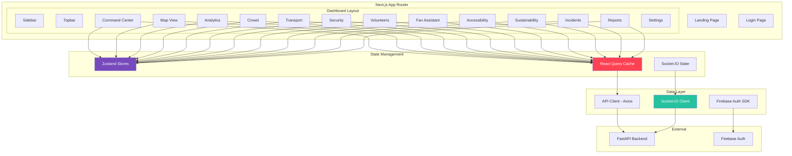

# FIFA Nexus AI — Frontend Architecture, Component Hierarchy & UI Wireframes

---

## Frontend Architecture Overview



---

## Design System

### Color Palette

```css
/* FIFA Nexus AI - Dark Premium Theme */
:root {
  /* Background Layers */
  --bg-primary:      hsl(225, 25%, 6%);       /* #0d0f14 - Main background */
  --bg-secondary:    hsl(225, 20%, 10%);       /* #151822 - Card background */
  --bg-tertiary:     hsl(225, 18%, 14%);       /* #1e2230 - Elevated surfaces */
  --bg-glass:        hsla(225, 20%, 15%, 0.6); /* Glassmorphism panels */
  --bg-glass-border: hsla(225, 30%, 30%, 0.3); /* Glass borders */

  /* Accent Colors */
  --accent-primary:   hsl(217, 91%, 60%);      /* #3b82f6 - Primary blue */
  --accent-secondary: hsl(262, 83%, 58%);      /* #8b5cf6 - Purple */
  --accent-success:   hsl(142, 71%, 45%);      /* #22c55e - Green */
  --accent-warning:   hsl(38, 92%, 50%);       /* #f59e0b - Amber */
  --accent-danger:    hsl(0, 84%, 60%);        /* #ef4444 - Red */
  --accent-info:      hsl(199, 89%, 48%);      /* #0ea5e9 - Cyan */
  --accent-fifa:      hsl(45, 100%, 51%);      /* #ffc107 - FIFA Gold */

  /* Text Colors */
  --text-primary:   hsl(210, 40%, 96%);        /* #f1f5f9 */
  --text-secondary: hsl(215, 20%, 65%);        /* #94a3b8 */
  --text-muted:     hsl(215, 15%, 45%);        /* #64748b */

  /* Gradients */
  --gradient-primary:  linear-gradient(135deg, #3b82f6 0%, #8b5cf6 100%);
  --gradient-danger:   linear-gradient(135deg, #ef4444 0%, #f97316 100%);
  --gradient-success:  linear-gradient(135deg, #22c55e 0%, #06b6d4 100%);
  --gradient-gold:     linear-gradient(135deg, #f59e0b 0%, #fbbf24 50%, #f59e0b 100%);
  --gradient-dark:     linear-gradient(180deg, #0d0f14 0%, #151822 100%);

  /* Shadows */
  --shadow-sm:    0 1px 2px hsla(0, 0%, 0%, 0.3);
  --shadow-md:    0 4px 12px hsla(0, 0%, 0%, 0.4);
  --shadow-lg:    0 8px 32px hsla(0, 0%, 0%, 0.5);
  --shadow-glow:  0 0 20px hsla(217, 91%, 60%, 0.3);

  /* Border Radius */
  --radius-sm:  6px;
  --radius-md:  10px;
  --radius-lg:  16px;
  --radius-xl:  24px;

  /* Glassmorphism */
  --glass-bg:      rgba(21, 24, 34, 0.6);
  --glass-border:  1px solid rgba(255, 255, 255, 0.08);
  --glass-blur:    blur(20px);
}
```

### Typography

```css
/* Font: Inter for UI, JetBrains Mono for data */
@import url('https://fonts.googleapis.com/css2?family=Inter:wght@300;400;500;600;700;800&family=JetBrains+Mono:wght@400;500;600&display=swap');

--font-sans:  'Inter', system-ui, -apple-system, sans-serif;
--font-mono:  'JetBrains Mono', 'Fira Code', monospace;

/* Scale */
--text-xs:    0.75rem;   /* 12px */
--text-sm:    0.875rem;  /* 14px */
--text-base:  1rem;      /* 16px */
--text-lg:    1.125rem;  /* 18px */
--text-xl:    1.25rem;   /* 20px */
--text-2xl:   1.5rem;    /* 24px */
--text-3xl:   1.875rem;  /* 30px */
--text-4xl:   2.25rem;   /* 36px */
```

### Animation Tokens

```css
/* Framer Motion Presets */
--ease-out-expo: cubic-bezier(0.16, 1, 0.3, 1);
--ease-in-out:   cubic-bezier(0.4, 0, 0.2, 1);
--duration-fast: 150ms;
--duration-base: 250ms;
--duration-slow: 400ms;

/* Keyframe Animations */
@keyframes pulse-glow {
  0%, 100% { box-shadow: 0 0 0 0 hsla(217, 91%, 60%, 0.4); }
  50%      { box-shadow: 0 0 20px 4px hsla(217, 91%, 60%, 0.2); }
}

@keyframes slide-up {
  from { opacity: 0; transform: translateY(12px); }
  to   { opacity: 1; transform: translateY(0); }
}

@keyframes shimmer {
  from { background-position: -200% 0; }
  to   { background-position: 200% 0; }
}
```

---

## Component Hierarchy

```mermaid
graph TB
    subgraph "App Root"
        ROOT[RootLayout]
        PROV[Providers - QueryClient, Zustand, Socket, Auth]
    end

    subgraph "Auth Layout"
        AUTH_L[AuthLayout]
        LOGIN[LoginPage]
    end

    subgraph "Dashboard Layout"
        DASH_L[DashboardLayout]
        SIDE[Sidebar]
        TOP[Topbar]

        subgraph "Sidebar Components"
            NAV[NavLinks]
            LOGO[LogoMark]
            ROLE[RoleBadge]
            COLLAPSE[CollapseToggle]
        end

        subgraph "Topbar Components"
            SEARCH[CommandSearch]
            NOTIF[NotificationBell]
            AVATAR[UserAvatar]
            LANG[LanguageSelector]
            LIVE[LiveIndicator]
        end
    end

    subgraph "Command Center Page"
        CMD[CommandCenterPage]
        CMD_GRID[DashboardGrid]
        STAT[StatCard x6]
        HEAT[HeatmapWidget]
        WEATHER[WeatherWidget]
        TRAFFIC[TrafficWidget]
        PARKING[ParkingWidget]
        ALERTS[AlertFeed]
        AI_SUM[AISummaryCard]
        VENDOR_S[VendorStatusWidget]
        ENERGY_G[EnergyGauge]
        WATER_G[WaterGauge]
    end

    subgraph "Map Page"
        MAP_P[MapPage]
        STAD_MAP[StadiumMap]
        HEAT_L[HeatmapLayer]
        ZONE_O[ZoneOverlay]
        POI[POIMarkers]
        ROUTE[RouteLayer]
        MAP_CTL[MapControls]
        MAP_LEG[MapLegend]
    end

    subgraph "Crowd Page"
        CROWD_P[CrowdPage]
        PRED_CH[PredictionChart]
        ZONE_D[ZoneDensityCard x N]
        RISK_I[RiskIndicator]
        ACT_S[ActionSuggestions]
        CONF_B[ConfidenceBars]
    end

    subgraph "Fan Assistant Page"
        FAN_P[FanAssistantPage]
        CHAT[ChatInterface]
        MSG[MessageBubble x N]
        QUICK[QuickActions]
        REC[RecommendationCard]
        VOICE[VoiceInput]
    end

    subgraph "Security Page"
        SEC_P[SecurityPage]
        CAM_GRID[CameraFeedGrid]
        CAM_CARD[CameraFeedCard x N]
        EVT_TL[EventTimeline]
        THREAT[ThreatAssessment]
        REC_P[RecommendationPanel]
    end

    subgraph "Volunteer Page"
        VOL_P[VolunteerPage]
        TASK_L[TaskList]
        TASK_C[TaskCard x N]
        VOL_MAP[VolunteerMap]
        SHIFT[ShiftTimeline]
        COPILOT[CopilotPanel]
    end

    subgraph "Transport Page"
        TRANS_P[TransportPage]
        ROUTE_C[RouteComparison]
        TRANS_S[TransportStatus]
        PARK_M[ParkingMap]
        CONG_F[CongestionForecast]
    end

    subgraph "Sustainability Page"
        SUS_P[SustainabilityPage]
        EN_CH[EnergyChart]
        WA_CH[WaterChart]
        WASTE[WasteTracker]
        CARBON[CarbonMeter]
        OPT[OptimizationPanel]
    end

    subgraph "Incidents Page"
        INC_P[IncidentPage]
        INC_F[IncidentForm]
        INC_C[IncidentCard x N]
        INC_TL[IncidentTimeline]
        DISP[DispatchPanel]
    end

    subgraph "Reports Page"
        REP_P[ReportsPage]
        BRIEF[BriefingCard]
        EXEC[ExecutiveSummary]
        REP_V[ReportViewer]
        KPI[KPIGrid]
    end

    subgraph "Analytics Page"
        ANA_P[AnalyticsPage]
        TREND[TrendChart x N]
        COMP[ComparisonChart]
        ACC[AccuracyTracker]
        MET_G[MetricGrid]
    end

    subgraph "Shared Components"
        ERR[ErrorBoundary]
        SKEL[LoadingSkeleton]
        EMPTY[EmptyState]
        GUARD[RoleGuard]
        RT_IND[RealtimeIndicator]
    end

    ROOT --> PROV --> AUTH_L & DASH_L
    AUTH_L --> LOGIN
    DASH_L --> SIDE & TOP
    DASH_L --> CMD & MAP_P & CROWD_P & FAN_P & SEC_P & VOL_P & TRANS_P & SUS_P & INC_P & REP_P & ANA_P

    style ROOT fill:#3b82f6,color:#fff
    style PROV fill:#8b5cf6,color:#fff
    style DASH_L fill:#22c55e,color:#fff
```



---

## UI Wireframes

### Wireframe 1: AI Command Center (Main Dashboard)

```
┌──────────────────────────────────────────────────────────────────────────────────┐
│ ┌─────┐  FIFA NEXUS AI                    🔍 Search...    🔔 3   🌐 EN   👤 Maria │
│ │ ≡   │                                                                          │
│ │LOGO │  ─ ─ ─ ─ ─ ─ ─ ─ ─ ─ ─ ─ ─ ─ ─ ─ ─ ─ ─ ─ ─ ─ ─ ─ ─ ─ ─ ─ ─ ─ ─ ─  │
│ │     │                                                                          │
│ │ 🏠  │  ┌──────────┐ ┌──────────┐ ┌──────────┐ ┌──────────┐ ┌──────────┐       │
│ │ CMD │  │ 👥 78,542│ │ 🚗 73.2% │ │ ⚠️  2    │ │ 🏥 1     │ │ ⚡ 1.2MW │       │
│ │     │  │Attendance│ │ Parking  │ │Sec Alert │ │Med Active│ │ Energy   │       │
│ │ 🗺️  │  │ ↑ 2.1%   │ │ ↑ 5.3%   │ │ → stable │ │ ↓ -1     │ │ → steady │       │
│ │ MAP │  └──────────┘ └──────────┘ └──────────┘ └──────────┘ └──────────┘       │
│ │     │                                                                          │
│ │ 📊  │  ┌─────────────────────────────────┐  ┌──────────────────────────┐       │
│ │ ANA │  │                                 │  │  🤖 AI SITUATION SUMMARY │       │
│ │     │  │     STADIUM HEATMAP             │  │                          │       │
│ │ 👥  │  │                                 │  │  North Stand occupancy   │       │
│ │ CRW │  │   ┌─────────────────────┐       │  │  increased 22% in 8min. │       │
│ │     │  │   │    🟢  🟡  🟡  🟢   │       │  │                          │       │
│ │ 🚗  │  │   │  🟢 ┌──────┐  🔴   │       │  │  Recommend redirecting   │       │
│ │ TRN │  │   │     │PITCH │       │       │  │  via Gate D. Open food   │       │
│ │     │  │   │  🟡 └──────┘  🟡   │       │  │  kiosks near Zone C.     │       │
│ │ 🔒  │  │   │    🟢  🟡  🟢  🟢   │       │  │                          │       │
│ │ SEC │  │   └─────────────────────┘       │  │  Weather: 28°C Partly    │       │
│ │     │  │                                 │  │  Cloudy. No weather risk. │       │
│ │ 🙋  │  │  🟢 <60%  🟡 60-85%  🔴 >85%  │  │                          │       │
│ │ VOL │  └─────────────────────────────────┘  │  ⏱️ Updated 30s ago      │       │
│ │     │                                        └──────────────────────────┘       │
│ │ 💬  │  ┌──────────────────┐  ┌──────────────────┐  ┌──────────────────┐       │
│ │ FAN │  │ 🌡️ WEATHER       │  │ 🚦 TRAFFIC       │  │ 🍔 VENDORS       │       │
│ │     │  │ 28.5°C           │  │ Moderate          │  │ 24/28 Open       │       │
│ │ ♿  │  │ Humidity: 65%    │  │ Metro: ✅ Normal  │  │ Avg Queue: 4.2m  │       │
│ │ ACC │  │ UV Index: 6.2    │  │ Bus: ⚠️ 5min delay│  │ Top: Green Bites │       │
│ │     │  │ Wind: 12km/h NW  │  │ Parking: 73%     │  │ Stock: ✅ Good   │       │
│ │ 🌱  │  └──────────────────┘  └──────────────────┘  └──────────────────┘       │
│ │ SUS │                                                                          │
│ │     │  ┌──────────────────────────────────────────────────────────────┐         │
│ │ 🚨  │  │ ⚡ LIVE ALERTS                                              │         │
│ │ INC │  │                                                              │         │
│ │     │  │ 🔴 18:28 Security | Unusual gathering at Gate B - Camera 18 │         │
│ │ 📋  │  │ 🟡 18:25 Medical  | Low supplies at Medical Station 3      │         │
│ │ RPT │  │ 🟢 18:20 Crowd    | Zone SS-C density normalized           │         │
│ │     │  │                                                              │         │
│ │ ⚙️  │  └──────────────────────────────────────────────────────────────┘         │
│ │ SET │                                                                          │
│ └─────┘                                                                          │
└──────────────────────────────────────────────────────────────────────────────────┘
```

### Wireframe 2: AI Crowd Prediction

```
┌──────────────────────────────────────────────────────────────────────────────────┐
│ SIDEBAR │  AI CROWD PREDICTION                                 🔴 LIVE  ⟳ 30s  │
│         │                                                                        │
│         │  ┌────────────────────────────────────────────────────────────────┐     │
│         │  │  ZONE PREDICTION OVERVIEW                                      │     │
│         │  │                                                                │     │
│         │  │  ┌──────────┐  ┌──────────┐  ┌──────────┐  ┌──────────┐       │     │
│         │  │  │ NS-A     │  │ NS-B     │  │ SS-A     │  │ SS-B     │       │     │
│         │  │  │ 92% 🔴   │  │ 78% 🟡   │  │ 65% 🟢   │  │ 71% 🟡   │       │     │
│         │  │  │ ↑ +5%    │  │ → stable │  │ ↓ -3%    │  │ ↑ +2%    │       │     │
│         │  │  │ CRITICAL │  │ MODERATE │  │ LOW      │  │ MODERATE │       │     │
│         │  │  └──────────┘  └──────────┘  └──────────┘  └──────────┘       │     │
│         │  └────────────────────────────────────────────────────────────────┘     │
│         │                                                                        │
│         │  ┌──────────────────────────────┐  ┌─────────────────────────────┐     │
│         │  │  📈 PREDICTION TIMELINE       │  │  🎯 CONFIDENCE SCORES      │     │
│         │  │                               │  │                             │     │
│         │  │  100%│        ╱──╮             │  │  5 min:  ████████░░  89%   │     │
│         │  │     │       ╱    ╰──           │  │  10 min: ██████░░░░  76%   │     │
│         │  │  80%│    ──╱                   │  │  15 min: █████░░░░░  62%   │     │
│         │  │     │  ╱──                     │  │                             │     │
│         │  │  60%│╱                         │  │  Model: Gemini 2.5 Pro     │     │
│         │  │     ├───┬───┬───┬───┬───►      │  │  Last updated: 18:30:00    │     │
│         │  │      Now  5m  10m 15m          │  │                             │     │
│         │  │  ── Predicted  ── Actual       │  │  ┌──────────────────┐       │     │
│         │  │  ░░ Confidence band            │  │  │ 🔮 Risk: HIGH    │       │     │
│         │  └──────────────────────────────┘  │  └──────────────────┘       │     │
│         │                                     └─────────────────────────────┘     │
│         │  ┌────────────────────────────────────────────────────────────────┐     │
│         │  │  💡 AI SUGGESTED ACTIONS                                       │     │
│         │  │                                                                │     │
│         │  │  1. ⚡ URGENT  Redirect incoming flow via Gate D               │     │
│         │  │     Reason: NS-A predicted to reach 96% in 10 minutes          │     │
│         │  │                                                                │     │
│         │  │  2. 🟡 HIGH    Open overflow section NS-B concourse            │     │
│         │  │     Reason: Adjacent zone has 22% spare capacity               │     │
│         │  │                                                                │     │
│         │  │  3. 🟢 MEDIUM  Deploy 3 volunteers to NS-A entrance            │     │
│         │  │     Reason: Flow management will reduce density growth by ~8%  │     │
│         │  │                                                                │     │
│         │  │  AI Reasoning: "Historical pattern shows halftime concession   │     │
│         │  │  rush peaks at minute 45. Current trajectory suggests NS-A     │     │
│         │  │  will exceed safe threshold without intervention."             │     │
│         │  └────────────────────────────────────────────────────────────────┘     │
└──────────────────────────────────────────────────────────────────────────────────┘
```

### Wireframe 3: Fan AI Assistant

```
┌──────────────────────────────────────────────────────────────────────────────────┐
│ SIDEBAR │  FAN AI ASSISTANT                              Language: Auto-detect  │
│         │                                                                        │
│         │  ┌────────────────────────────────────────────────────────────────┐     │
│         │  │                                                                │     │
│         │  │  ┌──── Quick Actions ────────────────────────────────────┐     │     │
│         │  │  │ 🚪 Find My Gate  │ 🍕 I'm Hungry  │ 🚗 Plan Departure │     │     │
│         │  │  │ 🚻 Restrooms     │ ♿ Accessibility │ 🏥 Medical Help  │     │     │
│         │  │  └──────────────────────────────────────────────────────┘     │     │
│         │  │                                                                │     │
│         │  │  ┌─ Your Info ──────────────────────────────────────────┐     │     │
│         │  │  │ 🎫 Seat: NS-A Row 12 Seat 8  │  🚪 Gate: D          │     │     │
│         │  │  │ 🌡️ 28°C Partly Cloudy        │  ⏰ Kickoff: 19:00   │     │     │
│         │  │  └──────────────────────────────────────────────────────┘     │     │
│         │  │                                                                │     │
│         │  │  ┌────────────────────────────────────────┐                   │     │
│         │  │  │  🤖 Welcome to FIFA Nexus AI!          │                   │     │
│         │  │  │  I'm your personal stadium assistant.  │                   │     │
│         │  │  │  Ask me anything in your language!      │                   │     │
│         │  │  └────────────────────────────────────────┘                   │     │
│         │  │                                                                │     │
│         │  │              ┌────────────────────────────────────────┐       │     │
│         │  │              │  मुझे भूख लगी है                        │       │     │
│         │  │              └────────────────────────────────────────┘       │     │
│         │  │                                                                │     │
│         │  │  ┌────────────────────────────────────────────────────┐       │     │
│         │  │  │  🤖 आपके पास सबसे नज़दीक 3 शाकाहारी विकल्प:         │       │     │
│         │  │  │                                                    │       │     │
│         │  │  │  1. 🥗 Green Bites (40m) - कतार 2 मिनट              │       │     │
│         │  │  │  2. 🌮 World Kitchen (65m) - कतार 5 मिनट             │       │     │
│         │  │  │  3. 🍕 Pizza Corner (90m) - कतार 3 मिनट              │       │     │
│         │  │  │                                                    │       │     │
│         │  │  │  ✨ सुझाव: Green Bites - सबसे नज़दीक, कम कतार!       │       │     │
│         │  │  │                                                    │       │     │
│         │  │  │  [📍 Show on Map]  [🧭 Navigate]                   │       │     │
│         │  │  └────────────────────────────────────────────────────┘       │     │
│         │  │                                                                │     │
│         │  │  ┌─────────────────────────────────────────────────────────┐  │     │
│         │  │  │  💬 Type your message... (any language)    🎤   ➤       │  │     │
│         │  │  └─────────────────────────────────────────────────────────┘  │     │
│         │  └────────────────────────────────────────────────────────────────┘     │
└──────────────────────────────────────────────────────────────────────────────────┘
```

### Wireframe 4: Volunteer Copilot

```
┌──────────────────────────────────────────────────────────────────────────────────┐
│ SIDEBAR │  VOLUNTEER COPILOT                     👤 Priya  │  Shift: 6h left   │
│         │                                                                        │
│         │  ┌──────────────────────────────────────────────────────────────┐       │
│         │  │  🤖 AI COPILOT SAYS                                         │       │
│         │  │  "You have 3 pending tasks. Start with Task #1 (URGENT) -   │       │
│         │  │   a fan needs wheelchair assistance at Gate B. Fastest       │       │
│         │  │   route via Corridor D (2 min walk)."                        │       │
│         │  └──────────────────────────────────────────────────────────────┘       │
│         │                                                                        │
│         │  ┌─ ACTIVE TASKS ──────────────────────────────────────────────┐       │
│         │  │                                                              │       │
│         │  │  ┌────────────────────────────────────────────────────┐      │       │
│         │  │  │ 🔴 URGENT │ Wheelchair Assistance                  │      │       │
│         │  │  │ 📍 Gate B │ Est: 15 min │ Distance: 120m           │      │       │
│         │  │  │ [🧭 Navigate]  [✅ Start]  [↗️ Reassign]            │      │       │
│         │  │  └────────────────────────────────────────────────────┘      │       │
│         │  │                                                              │       │
│         │  │  ┌────────────────────────────────────────────────────┐      │       │
│         │  │  │ 🟡 HIGH   │ Restock Water Station                  │      │       │
│         │  │  │ 📍 Zone C │ Est: 20 min │ Distance: 200m           │      │       │
│         │  │  │ [🧭 Navigate]  [✅ Start]  [↗️ Reassign]            │      │       │
│         │  │  └────────────────────────────────────────────────────┘      │       │
│         │  │                                                              │       │
│         │  │  ┌────────────────────────────────────────────────────┐      │       │
│         │  │  │ 🟢 MEDIUM │ Guide Group to Section                 │      │       │
│         │  │  │ 📍 Gate D │ Est: 10 min │ Distance: 80m            │      │       │
│         │  │  │ [🧭 Navigate]  [✅ Start]  [↗️ Reassign]            │      │       │
│         │  │  └────────────────────────────────────────────────────┘      │       │
│         │  │                                                              │       │
│         │  └──────────────────────────────────────────────────────────────┘       │
│         │                                                                        │
│         │  ┌─ SHIFT TIMELINE ────────────────────────────────────────────┐       │
│         │  │  14:00 ──●── 16:00 ──●── 18:00 ──◌── 20:00 ──◌── 22:00    │       │
│         │  │  Started    Break      NOW         Break       End          │       │
│         │  │  Tasks: 8   completed  │  3 pending              │       │
│         │  └─────────────────────────────────────────────────────────────┘       │
└──────────────────────────────────────────────────────────────────────────────────┘
```

### Wireframe 5: Security Copilot

```
┌──────────────────────────────────────────────────────────────────────────────────┐
│ SIDEBAR │  SECURITY COPILOT                           48/50 Cameras Online       │
│         │                                                                        │
│         │  ┌────────────────────────────────────────────────────────────────┐     │
│         │  │  🤖 THREAT ASSESSMENT: LOW-MEDIUM                              │     │
│         │  │  "2 active alerts. Camera 18 flagged unusual gathering at      │     │
│         │  │   Gate B — likely caused by delayed entry processing.          │     │
│         │  │   Recommend deploying 1 additional gate operator."             │     │
│         │  └────────────────────────────────────────────────────────────────┘     │
│         │                                                                        │
│         │  ┌── CAMERA FEEDS ─────────────────────────────────────────────┐       │
│         │  │  ┌───────────┐ ┌───────────┐ ┌───────────┐ ┌───────────┐   │       │
│         │  │  │ CAM-01 ✅ │ │ CAM-05 ✅ │ │ CAM-12 ✅ │ │ CAM-18 ⚠️ │   │       │
│         │  │  │ Gate A    │ │ NS-A     │ │ Conc. B  │ │ Gate B    │   │       │
│         │  │  │ Normal    │ │ Crowded  │ │ Normal   │ │ ALERT     │   │       │
│         │  │  └───────────┘ └───────────┘ └───────────┘ └───────────┘   │       │
│         │  └─────────────────────────────────────────────────────────────┘       │
│         │                                                                        │
│         │  ┌── EVENT TIMELINE ───────────────────────────────────────────┐       │
│         │  │  18:28  🔴  CAM-18  Unusual gathering detected             │       │
│         │  │              AI: "~40 people clustered. Pattern consistent  │       │
│         │  │              with entry bottleneck, not security threat."   │       │
│         │  │              [Acknowledge]  [Dispatch]  [Escalate]         │       │
│         │  │                                                            │       │
│         │  │  18:15  🟡  CAM-22  Unattended bag detected                │       │
│         │  │              AI: "Object appeared 3 min ago. 85% likely    │       │
│         │  │              personal item. Owner visible in frame."        │       │
│         │  │              [✅ Acknowledged by Officer Chen]              │       │
│         │  │                                                            │       │
│         │  │  18:02  🟢  CAM-07  Zone clear after crowd dispersal       │       │
│         │  │              AI: "Previous gathering resolved. Normal      │       │
│         │  │              flow patterns restored."                       │       │
│         │  │              [✅ Resolved]                                  │       │
│         │  └─────────────────────────────────────────────────────────────┘       │
└──────────────────────────────────────────────────────────────────────────────────┘
```

### Wireframe 6: Incident Commander

```
┌──────────────────────────────────────────────────────────────────────────────────┐
│ SIDEBAR │  INCIDENT COMMANDER                        Active Incidents: 2         │
│         │                                                                        │
│         │  ┌── REPORT INCIDENT ──────────────────────────────────────────┐       │
│         │  │  💬 Describe what happened (any language):                   │       │
│         │  │  ┌──────────────────────────────────────────────────────┐   │       │
│         │  │  │ Someone fainted near the food court in North Stand    │   │       │
│         │  │  └──────────────────────────────────────────────────────┘   │       │
│         │  │  [🚨 Submit Report]                                         │       │
│         │  └─────────────────────────────────────────────────────────────┘       │
│         │                                                                        │
│         │  ┌── AI TRIAGE RESULT ─────────────────────────────────────────┐       │
│         │  │  ┌─────────┐  ┌─────────┐  ┌──────────┐  ┌──────────┐     │       │
│         │  │  │ Type    │  │Severity │  │ Crowd    │  │ ETA      │     │       │
│         │  │  │ 🏥      │  │ 🔴 HIGH  │  │ 78.3%   │  │ 2.5 min  │     │       │
│         │  │  │ Medical │  │         │  │ Moderate │  │ MED-03   │     │       │
│         │  │  └─────────┘  └─────────┘  └──────────┘  └──────────┘     │       │
│         │  │                                                             │       │
│         │  │  📍 Location: North Stand Food Court, Zone NS-FC            │       │
│         │  │  🏥 Nearest Team: MED-03 at Medical Station 2               │       │
│         │  │  🛤️ Route: MS-2 → Corridor C → NS-FC (120m, 2.5 min)       │       │
│         │  │                                                             │       │
│         │  │  💡 DISPATCH RECOMMENDATION:                                │       │
│         │  │  "Deploy MED-03 via Corridor C (least crowded path).        │       │
│         │  │   Alert security to create 5m clearance zone.               │       │
│         │  │   Notify Gate F supervisor for ambulance standby."          │       │
│         │  │                                                             │       │
│         │  │  [✅ Approve & Dispatch]  [✏️ Modify]  [📍 Show on Map]     │       │
│         │  └─────────────────────────────────────────────────────────────┘       │
└──────────────────────────────────────────────────────────────────────────────────┘
```

---

## Responsive Breakpoints

| Breakpoint | Width | Layout Adaptation |
|-----------|-------|-------------------|
| Mobile | < 640px | Single column, bottom nav, collapsed sidebar |
| Tablet | 640-1024px | Two columns, collapsible sidebar |
| Desktop | 1024-1440px | Full sidebar, 3-column grid |
| Wide | > 1440px | Full sidebar, 4-column grid, expanded panels |

## Key Interaction Patterns

### Glassmorphism Card
```css
.glass-card {
  background: rgba(21, 24, 34, 0.6);
  backdrop-filter: blur(20px);
  border: 1px solid rgba(255, 255, 255, 0.08);
  border-radius: 16px;
  box-shadow: 0 8px 32px rgba(0, 0, 0, 0.3);
  transition: all 250ms cubic-bezier(0.4, 0, 0.2, 1);
}

.glass-card:hover {
  border-color: rgba(59, 130, 246, 0.3);
  box-shadow: 0 8px 32px rgba(0, 0, 0, 0.3), 0 0 20px rgba(59, 130, 246, 0.1);
  transform: translateY(-2px);
}
```

### Page Transition (Framer Motion)
```tsx
const pageVariants = {
  initial: { opacity: 0, y: 12 },
  animate: { opacity: 1, y: 0, transition: { duration: 0.3, ease: [0.16, 1, 0.3, 1] } },
  exit:    { opacity: 0, y: -8, transition: { duration: 0.2 } }
};
```

### Staggered List Animation
```tsx
const containerVariants = {
  animate: { transition: { staggerChildren: 0.06 } }
};

const itemVariants = {
  initial: { opacity: 0, x: -16 },
  animate: { opacity: 1, x: 0, transition: { duration: 0.3 } }
};
```

### Skeleton Loading
```tsx
<div className="animate-pulse space-y-3">
  <div className="h-4 bg-white/5 rounded w-3/4" />
  <div className="h-4 bg-white/5 rounded w-1/2" />
  <div className="h-32 bg-white/5 rounded" />
</div>
```

### Real-time Pulse Indicator
```css
.live-dot {
  width: 8px;
  height: 8px;
  border-radius: 50%;
  background: #22c55e;
  animation: pulse-glow 2s infinite;
}
```
