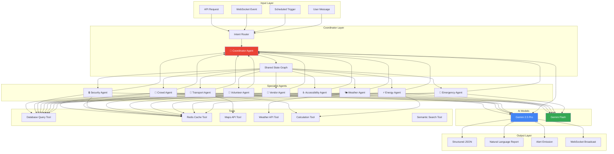
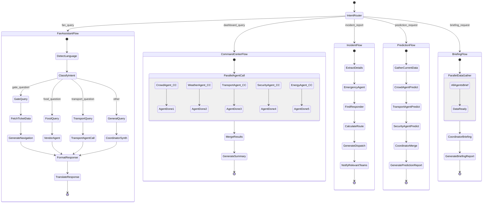
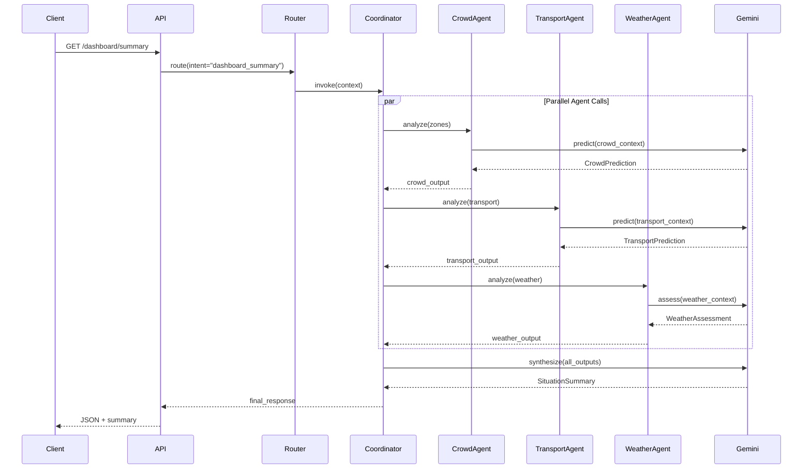

# FIFA Nexus AI — AI Agent Design, LangGraph Workflow & Prompt Engineering

---

## Multi-Agent Architecture Overview



---

## Agent Specifications

### Agent 1: Coordinator Agent 🧠

| Attribute | Value |
|-----------|-------|
| **Model** | Gemini 2.5 Pro |
| **Role** | Orchestrate multi-agent collaboration |
| **Input** | User intent + outputs from specialist agents |
| **Output** | Final structured response + natural language summary |
| **Trigger** | Every API request requiring AI, scheduled briefings |

**Responsibilities:**
1. Parse user intent and determine which specialist agents to invoke
2. Merge outputs from multiple agents into coherent response
3. Resolve conflicts between agent recommendations
4. Generate natural language summaries from structured data
5. Manage conversation context for Fan Assistant
6. Generate Daily Briefings and Executive Insights

---

### Agent 2: Crowd Agent 👥

| Attribute | Value |
|-----------|-------|
| **Model** | Gemini 2.5 Pro |
| **Role** | Predict crowd density and recommend actions |
| **Input** | Current zone metrics, historical patterns, match context |
| **Output** | `CrowdPrediction` structured output |
| **Trigger** | Every 60 seconds (scheduled), on-demand |

**Tools:**
- `query_crowd_metrics(zone_id, time_range)` — Fetch recent density readings
- `query_historical_patterns(zone_id, match_minute)` — Historical crowd data
- `calculate_flow_rate(zone_id)` — Gate flow rates
- `get_zone_capacity(zone_id)` — Zone capacity info

**Output Schema:**
```python
class CrowdPrediction(BaseModel):
    zone_id: str
    current_density: float
    predicted_5min: float
    predicted_10min: float
    predicted_15min: float
    confidence_5min: float  # 0-1
    confidence_10min: float
    confidence_15min: float
    risk_level: Literal["low", "medium", "high", "critical"]
    suggested_actions: list[str]
    reasoning: str
```

---

### Agent 3: Transport Agent 🚗

| Attribute | Value |
|-----------|-------|
| **Model** | Gemini 2.5 Pro |
| **Role** | Predict transport congestion, recommend routes |
| **Input** | Current transport metrics, crowd predictions, map data |
| **Output** | `TransportRecommendation` structured output |
| **Trigger** | Every 2 minutes, on-demand |

**Tools:**
- `query_transport_status(type)` — Current metro/bus/parking status
- `calculate_route(origin, destination, mode)` — Route calculation via Maps API
- `predict_exit_flow(gate_id)` — Predicted exit volume
- `get_parking_availability()` — Real-time parking data

**Output Schema:**
```python
class TransportRecommendation(BaseModel):
    best_exit_gate: str
    best_parking_zone: str
    fastest_route: RouteDetail
    least_crowded_route: RouteDetail
    congestion_predictions: dict[str, float]  # transport_type -> congestion_level
    recommended_departure_time: str
    reasoning: str

class RouteDetail(BaseModel):
    path: list[str]
    distance_m: float
    duration_minutes: float
    transport_mode: str
    crowd_level: str
```

---

### Agent 4: Security Agent 🔒

| Attribute | Value |
|-----------|-------|
| **Model** | Gemini 2.5 Pro |
| **Role** | Analyze camera events, assess threats, recommend actions |
| **Input** | Camera event data, zone context, historical patterns |
| **Output** | `SecurityAssessment` structured output |
| **Trigger** | On camera event, every 5 minutes (sweep) |

**Tools:**
- `query_camera_events(camera_id, time_range)` — Recent events
- `query_zone_context(zone_id)` — Zone status and crowd level
- `get_nearby_security_personnel(location)` — Available security staff
- `query_incident_history(zone_id)` — Past incidents in zone

**Output Schema:**
```python
class SecurityAssessment(BaseModel):
    event_id: str
    camera_id: str
    event_summary: str  # AI-generated natural language summary
    threat_level: Literal["info", "warning", "alert", "critical"]
    confidence: float
    likely_cause: str
    recommendation: str
    requires_dispatch: bool
    suggested_personnel: list[str]
```

---

### Agent 5: Volunteer Agent 🙋

| Attribute | Value |
|-----------|-------|
| **Model** | Gemini Flash |
| **Role** | Dynamically assign and reallocate volunteer tasks |
| **Input** | Open tasks, volunteer locations, skills, shift status |
| **Output** | `VolunteerAssignment` structured output |
| **Trigger** | On new task, every 3 minutes (rebalance) |

**Tools:**
- `query_available_volunteers(zone_id)` — Nearby available volunteers
- `query_pending_tasks(priority)` — Unassigned tasks
- `calculate_shortest_path(from_coords, to_coords)` — Path planning
- `get_volunteer_skills(volunteer_id)` — Skill matching

**Output Schema:**
```python
class VolunteerAssignment(BaseModel):
    task_id: str
    volunteer_id: str
    assignment_reason: str
    estimated_travel_minutes: float
    estimated_completion_minutes: float
    shortest_path: list[str]
    priority: Literal["low", "medium", "high", "urgent"]
    alternative_volunteers: list[str]
```

---

### Agent 6: Vendor Agent 🍔

| Attribute | Value |
|-----------|-------|
| **Model** | Gemini Flash |
| **Role** | Recommend food, predict queues, monitor stock |
| **Input** | Vendor metrics, user preferences, location |
| **Output** | `VendorRecommendation` structured output |
| **Trigger** | On-demand (fan request) |

**Tools:**
- `query_nearby_vendors(location, radius_m)` — Find nearby food
- `query_vendor_queue(vendor_id)` — Current queue length
- `query_vendor_menu(vendor_id)` — Menu and dietary info
- `match_preferences(user_prefs, vendors)` — Dietary matching

---

### Agent 7: Accessibility Agent ♿

| Attribute | Value |
|-----------|-------|
| **Model** | Gemini Flash |
| **Role** | Generate accessible routes, find accessible facilities |
| **Input** | User accessibility needs, location, destination |
| **Output** | `AccessibleRoute` structured output |
| **Trigger** | On-demand |

**Tools:**
- `calculate_accessible_route(from, to, needs)` — Elevator/ramp routing
- `find_accessible_facilities(type, location)` — Restrooms, exits
- `check_elevator_status(elevator_id)` — Real-time elevator status

---

### Agent 8: Weather Agent 🌤️

| Attribute | Value |
|-----------|-------|
| **Model** | Gemini Flash |
| **Role** | Monitor weather and assess impact on operations |
| **Input** | Weather API data, stadium context |
| **Output** | `WeatherAssessment` structured output |
| **Trigger** | Every 10 minutes |

**Tools:**
- `fetch_current_weather(lat, lng)` — Weather API call
- `fetch_weather_forecast(lat, lng, hours)` — Forecast data
- `assess_weather_impact(conditions)` — Impact on operations

---

### Agent 9: Energy Agent ⚡

| Attribute | Value |
|-----------|-------|
| **Model** | Gemini Flash |
| **Role** | Monitor energy/water/waste and generate optimization plans |
| **Input** | Energy, water, waste metrics |
| **Output** | `SustainabilityReport` structured output |
| **Trigger** | Every 5 minutes |

**Tools:**
- `query_energy_metrics(time_range)` — Electricity consumption
- `query_water_metrics(time_range)` — Water consumption
- `query_waste_metrics(time_range)` — Waste levels
- `calculate_carbon_footprint(metrics)` — CO2 calculation

---

### Agent 10: Emergency Agent 🚨

| Attribute | Value |
|-----------|-------|
| **Model** | Gemini 2.5 Pro |
| **Role** | Triage incidents, recommend dispatch, calculate routes |
| **Input** | Incident report (natural language or structured) |
| **Output** | `IncidentTriage` structured output |
| **Trigger** | On incident report |

**Tools:**
- `extract_incident_details(description)` — NLP extraction
- `find_nearest_responder(type, location)` — Closest medical/security
- `calculate_crowd_aware_route(from, to)` — Route avoiding crowds
- `assess_zone_crowd_level(zone_id)` — Current crowd at location

**Output Schema:**
```python
class IncidentTriage(BaseModel):
    incident_type: Literal["medical", "security", "fire", "structural", "crowd", "weather"]
    severity: Literal["low", "medium", "high", "critical"]
    extracted_location: str
    zone_id: str
    nearest_responder: ResponderInfo
    crowd_level_at_location: float
    fastest_route: RouteDetail
    dispatch_recommendation: str
    additional_actions: list[str]
```

---

## LangGraph Workflow



### LangGraph Implementation

```python
# app/agents/graph.py

from langgraph.graph import StateGraph, END
from langgraph.prebuilt import ToolNode
from app.agents.state import NexusState
from app.agents.coordinator import coordinator_node
from app.agents.crowd_agent import crowd_node
from app.agents.transport_agent import transport_node
from app.agents.security_agent import security_node
from app.agents.volunteer_agent import volunteer_node
from app.agents.vendor_agent import vendor_node
from app.agents.accessibility_agent import accessibility_node
from app.agents.weather_agent import weather_node
from app.agents.energy_agent import energy_node
from app.agents.emergency_agent import emergency_node

def build_nexus_graph():
    graph = StateGraph(NexusState)

    # Add nodes
    graph.add_node("intent_router", intent_router_node)
    graph.add_node("coordinator", coordinator_node)
    graph.add_node("crowd_agent", crowd_node)
    graph.add_node("transport_agent", transport_node)
    graph.add_node("security_agent", security_node)
    graph.add_node("volunteer_agent", volunteer_node)
    graph.add_node("vendor_agent", vendor_node)
    graph.add_node("accessibility_agent", accessibility_node)
    graph.add_node("weather_agent", weather_node)
    graph.add_node("energy_agent", energy_node)
    graph.add_node("emergency_agent", emergency_node)
    graph.add_node("response_formatter", format_response_node)

    # Entry point
    graph.set_entry_point("intent_router")

    # Routing logic
    graph.add_conditional_edges(
        "intent_router",
        route_by_intent,
        {
            "dashboard": "coordinator",
            "crowd": "crowd_agent",
            "transport": "transport_agent",
            "security": "security_agent",
            "volunteer": "volunteer_agent",
            "vendor": "vendor_agent",
            "accessibility": "accessibility_agent",
            "weather": "weather_agent",
            "energy": "energy_agent",
            "emergency": "emergency_agent",
            "multi_agent": "coordinator",
            "fan_chat": "coordinator",
        }
    )

    # All agents report to coordinator
    for agent in ["crowd_agent", "transport_agent", "security_agent",
                   "volunteer_agent", "vendor_agent", "accessibility_agent",
                   "weather_agent", "energy_agent", "emergency_agent"]:
        graph.add_edge(agent, "coordinator")

    # Coordinator to response
    graph.add_edge("coordinator", "response_formatter")
    graph.add_edge("response_formatter", END)

    return graph.compile()

# Shared state
class NexusState(TypedDict):
    intent: str
    user_context: dict
    match_context: dict
    agent_outputs: dict[str, Any]
    coordinator_synthesis: str
    final_response: dict
    language: str
    conversation_history: list[dict]
```

---

## Prompt Engineering Strategy

### Principle 1: Structured Output Enforcement

Every agent prompt ends with explicit JSON schema instruction:

```
You MUST respond with valid JSON matching this exact schema:
{schema}

Do NOT include any text outside the JSON object.
Do NOT use markdown code fences.
```

### Principle 2: Role-Specific System Prompts

Each agent has a distinct persona with domain expertise:

```python
CROWD_AGENT_SYSTEM = """You are the Crowd Intelligence Agent for FIFA World Cup 2026.

Your expertise:
- Crowd dynamics and flow patterns in large venues
- Density prediction using historical data and current trends
- Risk assessment for crowd safety
- Actionable recommendations for crowd management

You analyze zone-level crowd data and predict density 5, 10, and 15 minutes ahead.

Rules:
1. ALWAYS provide confidence scores (0-1) for each prediction
2. Risk levels: low (<60%), medium (60-80%), high (80-90%), critical (>90%)
3. Suggested actions must be specific and actionable
4. Reasoning must explain the prediction logic
5. Consider match minute, weather, and historical patterns
6. Never say "I don't know" — provide best estimate with low confidence instead
"""
```

### Principle 3: Context Injection Pattern

Every agent receives rich context before analysis:

```python
CONTEXT_TEMPLATE = """
=== MATCH CONTEXT ===
Match: {team_home} vs {team_away}
Stadium: {stadium_name} (Capacity: {capacity})
Kickoff: {kickoff_time}
Current Minute: {match_minute}
Status: {match_status}
Weather: {temperature}°C, {conditions}
Attendance: {attendance}

=== ZONE DATA ===
{zone_data_table}

=== RECENT HISTORY (last 15 minutes) ===
{recent_metrics}

=== CURRENT ALERTS ===
{active_alerts}

=== YOUR TASK ===
{task_instruction}
"""
```

### Principle 4: Multilingual Response

Fan Assistant uses language-aware prompting:

```python
FAN_ASSISTANT_SYSTEM = """You are the FIFA Nexus AI Fan Assistant.

Language Rules:
1. Detect the language of the user's message automatically
2. ALWAYS respond in the same language the user used
3. Supported languages: English, Hindi, Spanish, French, Arabic, Japanese, German
4. Use culturally appropriate expressions and formatting
5. For RTL languages (Arabic), structure response appropriately
6. Include emoji for universal visual cues

Personality:
- Friendly, helpful, concise
- Like a knowledgeable stadium guide who speaks every language
- Proactive: suggest next steps after answering
- Always include actionable elements (navigate, show on map, etc.)
"""
```

### Principle 5: Chain-of-Thought for Complex Decisions

For incident triage and critical decisions:

```python
EMERGENCY_AGENT_SYSTEM = """You are the Emergency Response Agent.

For every incident, follow this reasoning chain:

STEP 1 - EXTRACT: Parse the report for location, type, severity indicators
STEP 2 - CLASSIFY: Determine incident type and severity level
STEP 3 - LOCATE: Identify exact zone and coordinates
STEP 4 - ASSESS: Check crowd density at the location
STEP 5 - FIND: Identify nearest appropriate responder
STEP 6 - ROUTE: Calculate fastest crowd-aware path
STEP 7 - RECOMMEND: Generate specific dispatch instructions

Include your reasoning for each step in the output.
Never skip steps even for seemingly minor incidents.
"""
```

### Principle 6: Coordinator Synthesis

The Coordinator uses a merge-and-summarize pattern:

```python
COORDINATOR_SYSTEM = """You are the Central Coordinator Agent for FIFA Nexus AI.

You receive structured outputs from specialist agents and must:

1. MERGE: Combine all agent outputs into a unified view
2. RESOLVE: If agents disagree, prioritize by:
   - Safety agents (Emergency, Security) override all
   - Crowd agent overrides Transport/Vendor
   - User-facing agents adapt to coordinator decisions
3. SYNTHESIZE: Generate a natural language summary that:
   - Leads with the most critical information
   - Groups related insights
   - Provides clear, actionable recommendations
   - Uses professional but accessible language
4. ALERT: Flag any situation requiring immediate human attention

Output Format:
- structured_data: Complete merged JSON for frontend consumption
- summary: Natural language paragraph for the AI Summary Card
- alerts: List of any new alerts to emit
- priority_actions: Top 3 recommended actions ranked by urgency
"""
```

### Principle 7: Model Selection Strategy

| Scenario | Model | Rationale |
|----------|-------|-----------|
| Crowd Prediction | Gemini 2.5 Pro | Complex reasoning, high accuracy needed |
| Incident Triage | Gemini 2.5 Pro | Safety-critical, chain-of-thought |
| Security Analysis | Gemini 2.5 Pro | Nuanced threat assessment |
| Fan Chat | Gemini 2.5 Pro | Multilingual, context-heavy |
| Coordinator | Gemini 2.5 Pro | Complex synthesis |
| Vendor Recommendation | Gemini Flash | Simple matching, speed priority |
| Weather Assessment | Gemini Flash | Straightforward analysis |
| Energy Report | Gemini Flash | Data summarization |
| Accessibility Routing | Gemini Flash | Rule-based with AI enhancement |
| Volunteer Assignment | Gemini Flash | Pattern matching |

### Principle 8: Hallucination Prevention

```python
ANTI_HALLUCINATION_SUFFIX = """
CRITICAL RULES:
1. Only use data provided in the context above
2. Do NOT invent zone names, camera IDs, or vendor names
3. Do NOT fabricate crowd numbers — use the exact values provided
4. If data is missing, say "Data unavailable for [X]" with confidence 0
5. Predictions must be grounded in the provided historical patterns
6. Never make up incident details or security threats
"""
```

### Principle 9: Few-Shot Examples

Each agent prompt includes 2-3 examples of ideal input → output:

```python
CROWD_EXAMPLES = """
=== EXAMPLE 1 ===
Input: Zone NS-A at 78% density, match minute 42, flow rate +2.1%/min
Output:
{
  "predicted_5min": 88.5,
  "predicted_10min": 92.1,
  "predicted_15min": 85.3,
  "confidence_5min": 0.91,
  "risk_level": "high",
  "reasoning": "Halftime approaching (minute 45) drives concession rush.
  Historical data shows 10-15% surge in food court adjacent zones at
  minutes 42-50. Combined with current 2.1%/min growth rate.",
  "suggested_actions": [
    "Pre-position 2 crowd management volunteers at NS-A concourse",
    "Open overflow gate to NS-B (currently at 62%)",
    "Alert food vendors in Zone C to expedite service"
  ]
}
"""
```

---

## Agent Communication Protocol


