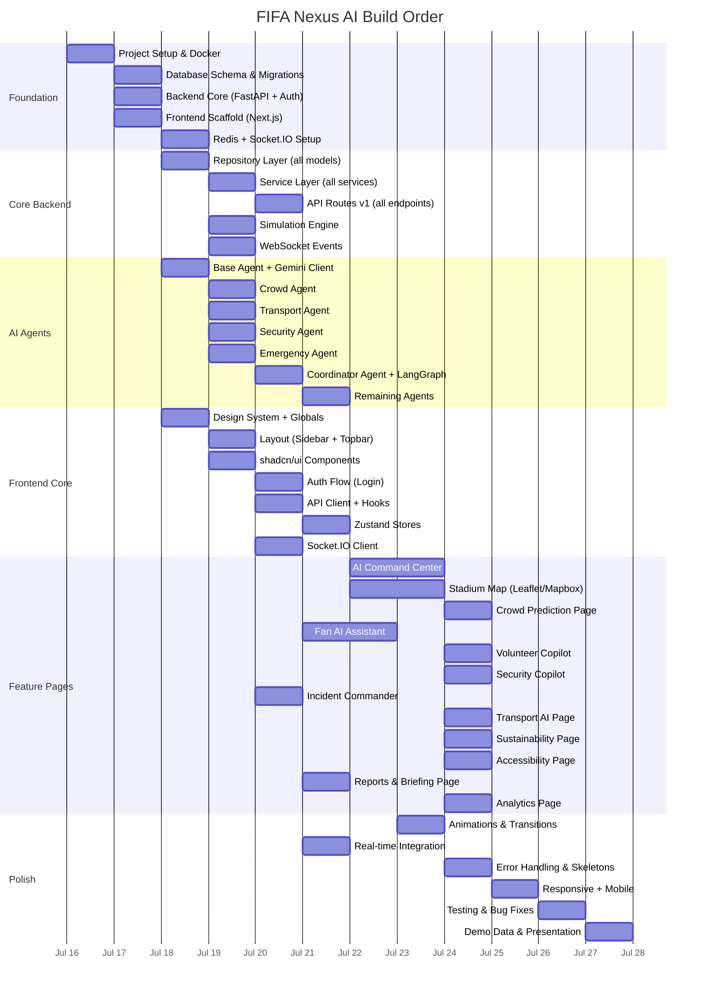

# FIFA Nexus AI — Sprint Plan, Milestones & Build Order

---

## Build Order (Critical Path)

The build must follow this exact dependency chain. Items at the same level can be built in parallel.



---

## Sprint Plan

### Sprint 1: Foundation (Day 1-2)

**Goal:** All infrastructure running, database ready, auth working.

| Task | Owner Role | Priority | Est. Hours |
|------|-----------|----------|-----------|
| Initialize project repos (monorepo) | DevOps | P0 | 1 |
| Docker Compose (Postgres, Redis, Backend, Frontend) | DevOps | P0 | 2 |
| Database schema (all 25+ tables) | Backend | P0 | 4 |
| Alembic migrations | Backend | P0 | 1 |
| FastAPI app skeleton + CORS + middleware | Backend | P0 | 2 |
| Firebase Auth integration (backend) | Backend | P0 | 2 |
| Next.js 16 scaffold + App Router setup | Frontend | P0 | 2 |
| TailwindCSS v4 + shadcn/ui setup | Frontend | P0 | 2 |
| Design system (colors, fonts, tokens) | UX Designer | P0 | 3 |
| Redis client + Socket.IO server setup | Backend | P0 | 2 |
| Seed data script | Backend | P1 | 2 |

**Deliverables:**
- ✅ `docker-compose up` runs full stack
- ✅ Database with all tables created
- ✅ Backend health check at `/health`
- ✅ Frontend rendering at `localhost:3000`
- ✅ Firebase login works end-to-end

---

### Sprint 2: Core Backend + AI Foundation (Day 3-4)

**Goal:** All repositories, services, API routes, and base AI agent working.

| Task | Owner Role | Priority | Est. Hours |
|------|-----------|----------|-----------|
| Base repository with generic CRUD | Backend | P0 | 2 |
| All 16 repositories | Backend | P0 | 6 |
| All 15 services | Backend | P0 | 8 |
| All API v1 routes (stubs → full) | Backend | P0 | 8 |
| WebSocket event handlers | Backend | P0 | 3 |
| Simulation engine (crowd, transport, weather) | Backend | P0 | 6 |
| Gemini client wrapper | AI Engineer | P0 | 2 |
| Base agent class | AI Engineer | P0 | 2 |
| Crowd Agent + prompts | AI Engineer | P0 | 4 |
| Transport Agent + prompts | AI Engineer | P0 | 4 |
| Security Agent + prompts | AI Engineer | P0 | 4 |
| Emergency Agent + prompts | AI Engineer | P0 | 4 |

**Deliverables:**
- ✅ All API endpoints return data
- ✅ Simulation generates realistic live data
- ✅ Crowd Agent returns predictions via Gemini
- ✅ WebSocket emits crowd updates every 30s

---

### Sprint 3: AI Orchestration + Frontend Shell (Day 5-6)

**Goal:** LangGraph multi-agent coordination working. Frontend layout and navigation complete.

| Task | Owner Role | Priority | Est. Hours |
|------|-----------|----------|-----------|
| Coordinator Agent | AI Engineer | P0 | 6 |
| LangGraph graph definition | AI Engineer | P0 | 4 |
| Volunteer Agent | AI Engineer | P0 | 3 |
| Vendor Agent | AI Engineer | P1 | 2 |
| Weather Agent | AI Engineer | P1 | 2 |
| Energy Agent | AI Engineer | P1 | 2 |
| Accessibility Agent | AI Engineer | P1 | 2 |
| Intent router | AI Engineer | P0 | 3 |
| Sidebar component | Frontend | P0 | 3 |
| Topbar component | Frontend | P0 | 2 |
| Dashboard layout (route group) | Frontend | P0 | 2 |
| Auth flow (login page) | Frontend | P0 | 3 |
| API client (Axios wrapper) | Frontend | P0 | 2 |
| React Query hooks (all data fetching) | Frontend | P0 | 4 |
| Zustand stores (auth, dashboard, alerts) | Frontend | P0 | 3 |
| Socket.IO client hook | Frontend | P0 | 2 |

**Deliverables:**
- ✅ LangGraph coordinates multi-agent queries
- ✅ `/dashboard/summary` returns AI-synthesized response
- ✅ Frontend shell with working navigation
- ✅ Login → Dashboard flow works

---

### Sprint 4: Feature Pages — Tier 1 (Day 7-9)

**Goal:** The 4 most impressive pages fully functional.

| Task | Owner Role | Priority | Est. Hours |
|------|-----------|----------|-----------|
| **AI Command Center** | Frontend | P0 | 12 |
| ├── Stat cards (6 KPIs) | Frontend | P0 | 2 |
| ├── Stadium heatmap widget | Frontend | P0 | 4 |
| ├── AI Summary Card (real-time) | Frontend | P0 | 3 |
| ├── Weather/Traffic/Vendor widgets | Frontend | P0 | 3 |
| └── Alert feed (live via WebSocket) | Frontend | P0 | 3 |
| **Stadium Map** | Frontend | P0 | 10 |
| ├── Leaflet/Mapbox integration | Frontend | P0 | 4 |
| ├── Heatmap overlay layer | Frontend | P0 | 3 |
| ├── POI markers (food, medical, etc.) | Frontend | P0 | 2 |
| └── Route display | Frontend | P1 | 2 |
| **Fan AI Assistant** | Frontend | P0 | 10 |
| ├── Chat interface with message bubbles | Frontend | P0 | 4 |
| ├── Quick action buttons | Frontend | P0 | 2 |
| ├── AI integration (multilingual) | Frontend | P0 | 3 |
| └── Voice input (STT) | Frontend | P1 | 3 |
| **Incident Commander** | Frontend | P0 | 8 |
| ├── Natural language report form | Frontend | P0 | 2 |
| ├── AI triage result display | Frontend | P0 | 3 |
| └── Dispatch panel | Frontend | P0 | 3 |

**Deliverables:**
- ✅ Command Center shows live AI-summarized dashboard
- ✅ Map displays interactive heatmap
- ✅ Fan Assistant responds in Hindi/Spanish/etc.
- ✅ Incident Commander triages natural language reports

---

### Sprint 5: Feature Pages — Tier 2 (Day 10-11)

**Goal:** All remaining feature pages.

| Task | Owner Role | Priority | Est. Hours |
|------|-----------|----------|-----------|
| Crowd Prediction page | Frontend | P0 | 6 |
| ├── Prediction timeline chart | Frontend | P0 | 3 |
| ├── Confidence scores | Frontend | P0 | 1 |
| └── Suggested actions panel | Frontend | P0 | 2 |
| Volunteer Copilot page | Frontend | P0 | 6 |
| ├── Task list with cards | Frontend | P0 | 3 |
| ├── AI copilot panel | Frontend | P0 | 2 |
| └── Shift timeline | Frontend | P1 | 1 |
| Security Copilot page | Frontend | P0 | 6 |
| ├── Camera feed grid | Frontend | P0 | 2 |
| ├── Event timeline | Frontend | P0 | 2 |
| └── Threat assessment panel | Frontend | P0 | 2 |
| Transport AI page | Frontend | P0 | 5 |
| Sustainability page | Frontend | P1 | 4 |
| Accessibility page | Frontend | P1 | 4 |
| Analytics page | Frontend | P1 | 4 |
| Reports/Briefing page | Frontend | P1 | 4 |
| Settings page | Frontend | P2 | 2 |

**Deliverables:**
- ✅ All 12 pages functional
- ✅ Real-time data flowing to all pages

---

### Sprint 6: Polish & Demo (Day 12-14)

**Goal:** Production-quality polish, demo-ready presentation.

| Task | Owner Role | Priority | Est. Hours |
|------|-----------|----------|-----------|
| Framer Motion page transitions | Frontend | P0 | 3 |
| Staggered list animations | Frontend | P0 | 2 |
| Glassmorphism card hover effects | Frontend | P0 | 2 |
| Loading skeletons (all pages) | Frontend | P0 | 3 |
| Error boundaries | Frontend | P0 | 2 |
| Responsive (tablet + mobile) | Frontend | P0 | 6 |
| Real-time indicator (live dot) | Frontend | P1 | 1 |
| Notification system | Frontend | P1 | 3 |
| Role-based dashboard routing | Frontend | P0 | 3 |
| End-to-end testing | QA | P0 | 6 |
| Demo script preparation | Product | P0 | 4 |
| Demo data tuning (impressive scenarios) | Backend | P0 | 4 |
| Performance optimization | DevOps | P1 | 3 |
| README + documentation | All | P1 | 3 |

**Deliverables:**
- ✅ Smooth, premium animations throughout
- ✅ Zero crashes, zero blank screens
- ✅ Demo script with pre-seeded scenarios
- ✅ README with setup instructions

---

## Milestones

| # | Milestone | Target | Verification |
|---|-----------|--------|-------------|
| M1 | **Infrastructure Ready** | Day 2 | Docker stack runs, DB migrated, auth works |
| M2 | **API Complete** | Day 4 | All endpoints return valid data |
| M3 | **AI Agents Online** | Day 6 | Multi-agent coordination returns AI summaries |
| M4 | **MVP Dashboard** | Day 8 | Command Center + Map + Fan Assistant working |
| M5 | **Full Feature Set** | Day 11 | All 12 pages functional with live data |
| M6 | **Demo Ready** | Day 14 | Polished, animated, responsive, zero-crash |

---

## Risk Mitigation

| Risk | Probability | Impact | Mitigation |
|------|:-----------:|:------:|-----------|
| Gemini API latency | Medium | High | Cache predictions, use Flash for non-critical agents |
| Gemini rate limits | Medium | High | Implement request queuing, batch agent calls |
| WebSocket stability | Low | High | Fallback to polling, reconnection logic |
| Complex map integration | Medium | Medium | Start with Leaflet (simpler), upgrade to Mapbox if time allows |
| Scope creep | High | High | Strict sprint boundaries, P0-only in early sprints |
| Demo data quality | Medium | High | Dedicated simulation engine with realistic patterns |

---

## Build Order Summary (Priority Sequence)

### Must Build First (Foundation - Cannot skip)
```
1. Docker + Postgres + Redis
2. FastAPI skeleton + Firebase Auth
3. Next.js scaffold + TailwindCSS + shadcn/ui
4. Database schema + migrations
5. Seed data
```

### Must Build Second (Core - Everything depends on this)
```
6. Repository layer (all models)
7. Service layer (all services)
8. API routes (all endpoints)
9. Simulation engine
10. WebSocket server + events
```

### Must Build Third (AI - The differentiator)
```
11. Gemini client wrapper
12. Base agent class
13. Crowd Agent (most critical)
14. Emergency Agent (most impressive)
15. Coordinator Agent + LangGraph
16. All remaining agents
```

### Must Build Fourth (Frontend - The showcase)
```
17. Design system (colors, fonts, glassmorphism)
18. Layout (sidebar, topbar)
19. Auth flow
20. API client + hooks + stores
21. AI Command Center (hero page)
22. Stadium Map
23. Fan AI Assistant
24. Incident Commander
25. All remaining pages
```

### Must Build Last (Polish - The win)
```
26. Framer Motion animations
27. Loading skeletons + error boundaries
28. Responsive design
29. Real-time indicators
30. Demo data + presentation script
```

---

## Team Allocation (Parallel Workstreams)

```
Workstream A (Backend + AI):
  Sprint 1-2: FastAPI + DB + Repositories + Services + APIs
  Sprint 3-4: AI Agents + LangGraph + Simulation
  Sprint 5-6: AI tuning + Demo data

Workstream B (Frontend):
  Sprint 1-2: Next.js + Design System + Layout + Auth
  Sprint 3-4: Command Center + Map + Fan Assistant + Incidents
  Sprint 5-6: Remaining pages + Polish + Animations

Workstream C (Infrastructure):
  Sprint 1: Docker + Postgres + Redis + Firebase
  Sprint 2-3: WebSocket + Monitoring
  Sprint 4-6: Performance + Deployment + Testing
```
